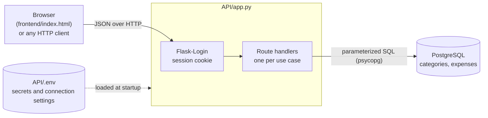
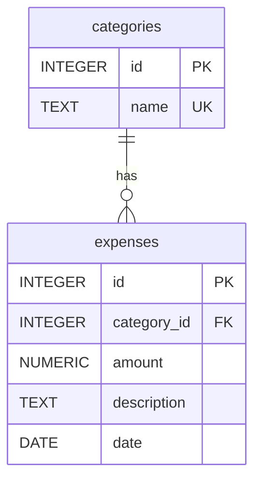
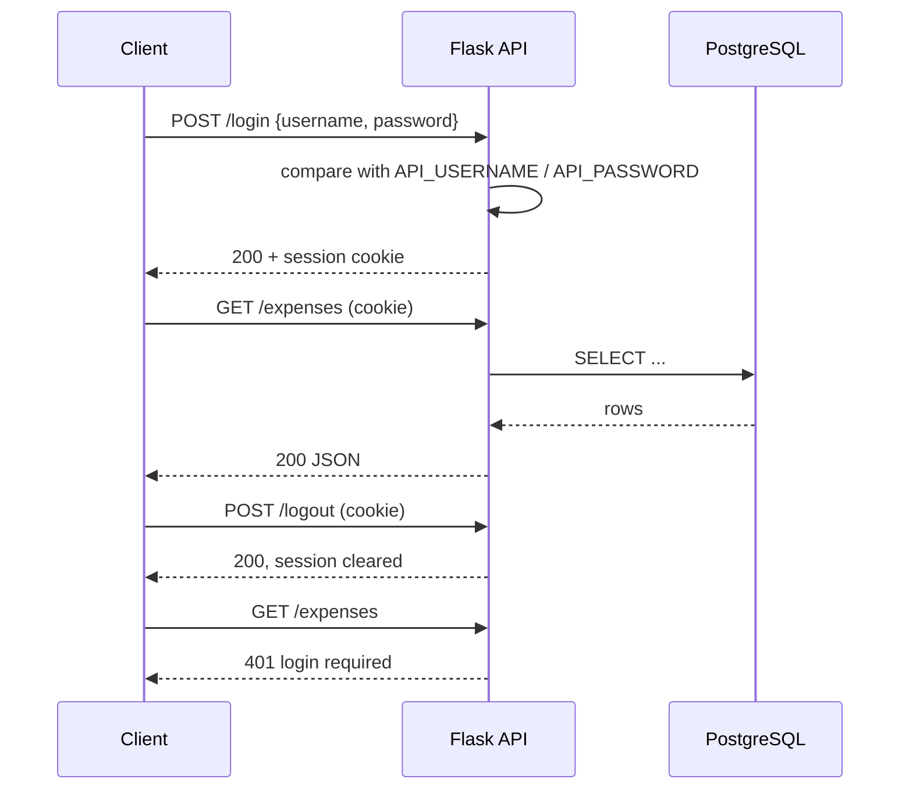

# Personal Expense Tracker

A PostgreSQL database for logging expenses by category, a Flask API that exposes each of its queries over HTTP behind a login, and a single-page web frontend for the API.



## Repository layout

| Path | Contents |
|------|----------|
| `sql/setup.sql` | Creates the tables and seeds the default categories |
| `sql/queries.sql` | One SQL query per use case |
| `API/app.py` | The Flask API |
| `API/requirements.txt` | Python dependencies |
| `API/.env` | Secrets and system-specific settings (placeholders until filled in) |
| `frontend/index.html` | The web frontend: one HTML file with inline CSS and JavaScript |
| `datadictionary.md` | Use cases, business rules and the data dictionary |

---

## Database

### Entity relationship diagram



One category has zero or more expenses. Every expense belongs to exactly one category.

### Tables

#### `categories`

| Column | Type | Constraints | Description |
|--------|------|-------------|-------------|
| `id` | INTEGER | PRIMARY KEY, GENERATED ALWAYS AS IDENTITY | Unique identifier |
| `name` | TEXT | NOT NULL, UNIQUE | Category label, e.g. "Food & Dining" |

#### `expenses`

| Column | Type | Constraints | Description |
|--------|------|-------------|-------------|
| `id` | INTEGER | PRIMARY KEY, GENERATED ALWAYS AS IDENTITY | Unique identifier |
| `category_id` | INTEGER | NOT NULL, FOREIGN KEY → `categories.id` | Category the expense belongs to |
| `amount` | NUMERIC(10, 2) | NOT NULL, CHECK (`amount > 0`) | Amount spent |
| `description` | TEXT | NOT NULL | What the expense was for |
| `date` | DATE | NOT NULL | Date of the expense |

### Rules the database enforces

- Category names are unique.
- An expense amount must be greater than zero.
- An expense must reference an existing category.
- Ids are generated by the database and cannot be supplied by the caller.
- A category that still has expenses cannot be deleted, because the foreign key has no cascade.

### Seed data

`setup.sql` inserts eight default categories: Food & Dining, Transportation, Housing, Entertainment, Health & Medical, Shopping, Utilities and Other. The script is safe to re-run: tables are created with `IF NOT EXISTS` and the seed insert skips names that already exist.

### Setup

```bash
createdb <DB_NAME>
psql -h <DB_HOST> -p <DB_PORT> -U <DB_USER> -d <DB_NAME> -f sql/setup.sql
```

---

## API

### Setup

1. Install the dependencies:

   ```bash
   cd API
   pip install -r requirements.txt
   ```

2. Replace every `<PLACEHOLDER>` in `API/.env`:

   | Variable | Purpose |
   |----------|---------|
   | `SECRET_KEY` | Signs the session cookie. Generate one with `python -c "import secrets; print(secrets.token_hex(32))"` |
   | `API_HOST`, `API_PORT` | Address the API listens on |
   | `API_USERNAME`, `API_PASSWORD` | The single API login |
   | `DB_HOST`, `DB_PORT`, `DB_NAME`, `DB_USER`, `DB_PASSWORD` | PostgreSQL connection |

3. Start the server:

   ```bash
   python app.py
   ```

   This runs Flask's built-in development server. Keep `API/.env` out of version control.

### Authentication

The API has one user, whose username and password are set in `.env`. Logging in sets a session cookie; every other endpoint returns `401` without it.



| Endpoint | Body | Success |
|----------|------|---------|
| `POST /login` | `{"username": "...", "password": "..."}` | `200 {"message": "logged in"}` |
| `POST /logout` | none | `200 {"message": "logged out"}` |

### Endpoints

Each endpoint runs the matching query from `sql/queries.sql`. All of them require a logged-in session.

| # | Use case | Endpoint | Input | Success |
|---|----------|----------|-------|---------|
| 1 | Add a category | `POST /categories` | JSON `name` | `201`, the new category |
| 2 | List categories | `GET /categories` | none | `200`, list ordered by name |
| 3 | Add an expense | `POST /expenses` | JSON `category_id`, `amount`, `description`, `date` | `201`, the new expense |
| 4 | List expenses | `GET /expenses` | none | `200`, list, most recent first |
| 5 | Expenses for a category | `GET /expenses/by-category` | `?name=` | `200`, list, most recent first |
| 6 | Totals per category | `GET /expenses/totals-by-category` | none | `200`, list, highest total first |
| 7 | Expenses in a date range | `GET /expenses/by-date-range` | `?start=&end=` (YYYY-MM-DD, inclusive) | `200`, list, most recent first |
| 8 | Total for a month | `GET /expenses/monthly-total` | `?month=` (YYYY-MM) | `200`, single object |
| 9 | Delete an expense | `DELETE /expenses/<id>` | id in the path | `204`, no body |

### Response formats

- Dates are ISO strings: `"2026-09-01"`.
- Amounts and totals are strings, to keep exact decimal values: `"45.99"`.
- Categories with no expenses appear in the totals with `num_expenses` of `0` and `total_spent` of `null`.
- A month with no expenses returns `{"monthly_total": null}`.

| Endpoint | Fields in each object |
|----------|-----------------------|
| `POST /categories`, `GET /categories` | `id`, `name` |
| `POST /expenses` | `id`, `category_id`, `amount`, `description`, `date` |
| `GET /expenses`, `GET /expenses/by-date-range` | `id`, `category`, `amount`, `description`, `date` |
| `GET /expenses/by-category` | `id`, `amount`, `description`, `date` |
| `GET /expenses/totals-by-category` | `category`, `num_expenses`, `total_spent` |
| `GET /expenses/monthly-total` | `monthly_total` |

### Errors

Errors are JSON objects of the form `{"error": "<message>"}`.

| Status | When |
|--------|------|
| `400` | A required field or query parameter is missing, a value is malformed (for example an invalid date), the amount is not positive, or `category_id` does not exist |
| `401` | Not logged in, or wrong credentials on `/login` |
| `404` | The expense to delete does not exist |
| `409` | A category with that name already exists |
| `503` | The database cannot be reached |

### Example session

These examples use curl; the [frontend](#frontend) makes the same calls from the browser.

```bash
BASE=http://<API_HOST>:<API_PORT>

# Log in and keep the session cookie
curl -c cookies.txt -X POST $BASE/login \
  -H 'Content-Type: application/json' \
  -d '{"username": "<API_USERNAME>", "password": "<API_PASSWORD>"}'

# Add a category
curl -b cookies.txt -X POST $BASE/categories \
  -H 'Content-Type: application/json' \
  -d '{"name": "Travel"}'

# Add an expense
curl -b cookies.txt -X POST $BASE/expenses \
  -H 'Content-Type: application/json' \
  -d '{"category_id": 1, "amount": 45.99, "description": "Grocery run", "date": "2026-09-01"}'

# Expenses for one category (URL-encode the name)
curl -b cookies.txt -G $BASE/expenses/by-category --data-urlencode 'name=Food & Dining'

# Expenses in September, and the month's total
curl -b cookies.txt "$BASE/expenses/by-date-range?start=2026-09-01&end=2026-09-30"
curl -b cookies.txt "$BASE/expenses/monthly-total?month=2026-09"

# Delete an expense
curl -b cookies.txt -X DELETE $BASE/expenses/1
```

---

## Frontend

`frontend/index.html` is a single page with no build step and no dependencies. The API serves it at `/`, so once the server is running, open `http://<API_HOST>:<API_PORT>/` and log in with `API_USERNAME` and `API_PASSWORD`.

The page must be loaded from the API rather than opened as a file: it calls the API with relative URLs and relies on the session cookie being same-origin.

| Part of the page | What it does | Endpoints used |
|------------------|--------------|----------------|
| Login screen | Logs in; shown whenever the API answers `401` | `POST /login` |
| Log out button | Ends the session | `POST /logout` |
| Add expense | Adds an expense to a chosen category | `GET /categories`, `POST /expenses` |
| Add category | Adds a category | `POST /categories` |
| Monthly total | Shows the total for the selected month | `GET /expenses/monthly-total` |
| Expenses | Lists all expenses, one category, or a date range, with a delete button per row | `GET /expenses`, `GET /expenses/by-category`, `GET /expenses/by-date-range`, `DELETE /expenses/<id>` |
| Spending by category | Shows the expense count and total for every category | `GET /expenses/totals-by-category` |

Amounts are displayed in US dollars. The page follows the browser's light or dark colour scheme.
